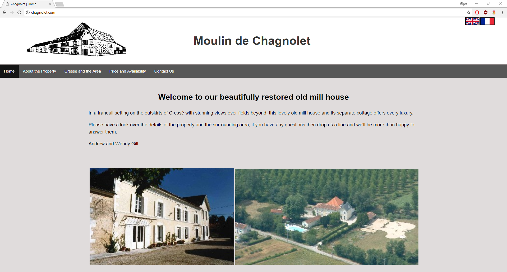

# Chagnolet

My grandparents own a property that had a very dated website. As a first project I decided to give it an upgrade. Styling isn't my forté
so I have opted for a clean simple look.

---

---

## Getting Started

I use the [XAMPP](https://www.apachefriends.org/index.html) stack to develop & test this project locally.

---

## Deployment

I use FileZilla to securely upload all the files to my chosen web hosting service. I've also set up an email address to receive any messages from potential customers.

---

## Built With

HTML5, CSS3 & PHP.

---

## Author

**Skye Gill** - [Skyerus](https://github.com/Skyerus)

